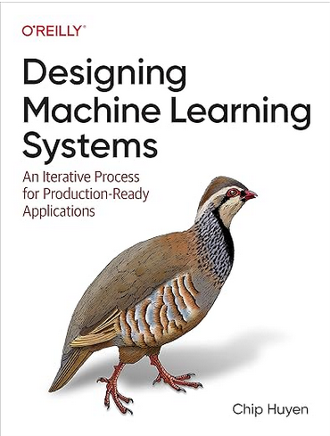
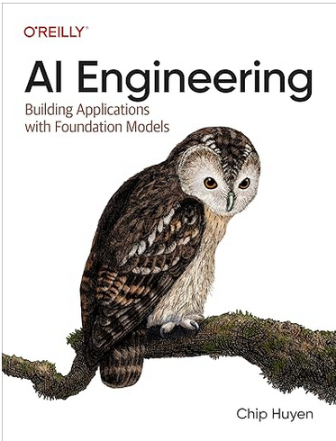
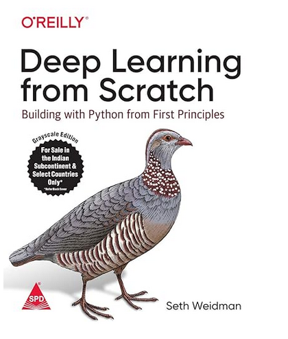
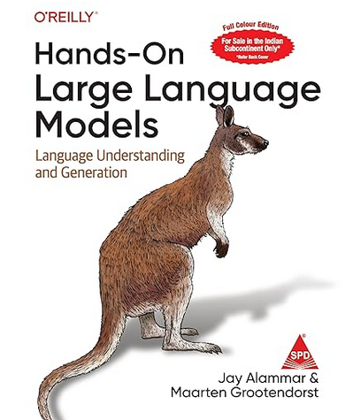
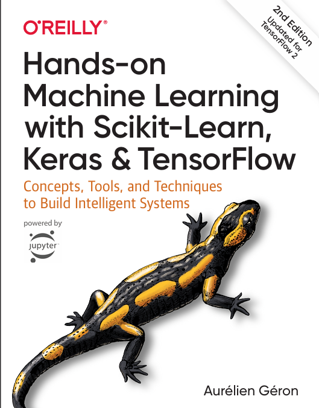

# AI-ML-Resources
🌟 Open-source collection of AI/ML learning resources. Curated for students, developers & aspiring AI engineers.

# 🤖 AI & ML Books Collection

> A curated collection of must-read books for anyone who wants to learn 
  Artificial Intelligence and Machine Learning — from beginner to advanced level.

> 📢 **More books are being added regularly. Stay tuned and ⭐ star this repo!**

---

## 📌 Table of Contents

- [Designing Machine Learning Systems](#1-designing-machine-learning-systems)
- [AI Engineering](#2-ai-engineering)
- [Deep Learning from Scratch](#3-deep-learning-from-scratch)
- [Hands-On Large Language Models](#4-hands-on-large-language-models)
- [Hands-On ML with Scikit-Learn Keras & TensorFlow](#5-hands-on-ml-with-scikit-learn-keras--tensorflow)
- [More Books Coming Soon](#-more-books-coming-soon)

---

## 1. Designing Machine Learning Systems

**Author:** Chip Huyen
**Year:** 2022
**Publisher:** O'Reilly Media
**Level:** Intermediate to Advanced

### 📖 About
ML systems are complex because they involve many moving parts and different 
stakeholders. This book gives you a complete, practical approach to building 
ML systems that work well in the real world — not just in experiments. 
It covers the entire lifecycle from data collection to deployment and monitoring.

### 👥 Who Should Read This
- ML Engineers who want to build production-ready systems
- Data Scientists who want to move beyond Jupyter notebooks
- Software Engineers transitioning into ML roles
- Engineering Managers leading ML teams

### ✅ What You Will Learn
- How to frame ML problems from a business perspective
- Data engineering, feature stores and data pipelines
- Choosing the right model for the right problem
- Deployment strategies — batch, real-time, edge
- Monitoring models after deployment
- Detecting data drift and model degradation
- MLOps workflows and automation for teams

### 📑 Chapters Overview
| Chapter | Topic |
|---------|-------|
| 1 | Overview of Machine Learning Systems |
| 2 | Introduction to ML Systems Design |
| 3 | Data Engineering Fundamentals |
| 4 | Training Data |
| 5 | Feature Engineering |
| 6 | Model Development and Offline Evaluation |
| 7 | Model Deployment and Prediction Service |
| 8 | Data Distribution Shifts and Monitoring |
| 9 | Continual Learning and Test in Production |
| 10 | Infrastructure and Tooling for MLOps |
| 11 | The Human Side of Machine Learning |

### ⭐ What People Say
> *"The very best book you can read about how to build, deploy, and scale 
ML models at a company."*
— Josh Wills, Former Director of Data Engineering, Slack

> *"If you are serious about ML in production, this book is essential."*
— Laurence Moroney, AI & ML Lead, Google

> *"A must-read to navigate the landscape of tooling and platform options."*
— Goku Mohandas, Founder of Made With ML

### 📥 Get This Book
- 🌊 [OceanofPDF](https://oceanofpdf.com) — Get this book for free here
- 🏛️ [Borrow Free on Archive.org](https://archive.org/search?query=designing+machine+learning+systems)
- 🛒 [Buy on Amazon](https://www.amazon.in/s?k=designing+machine+learning+systems)
- 🔍 Search: `"Designing Machine Learning Systems Chip Huyen pdf"`

 

---

## 2. AI Engineering

**Author:** Chip Huyen
**Year:** 2024
**Publisher:** O'Reilly Media
**Level:** Intermediate to Advanced

### 📖 About
This book is a complete guide for building real applications using foundation 
models and LLMs. As AI tools become more powerful, this book teaches you how 
to use them properly — not just prompt them, but build systems around them 
that are reliable, fast, and cost-efficient.

### 👥 Who Should Read This
- Software Engineers building AI-powered products
- ML Engineers working with large language models
- Developers who want to build on top of GPT, Claude, Gemini etc.
- Anyone moving from traditional ML to modern AI Engineering

### ✅ What You Will Learn
- Difference between AI Engineering and traditional ML Engineering
- How to work with foundation model APIs effectively
- Evaluation strategies for AI applications
- Retrieval-Augmented Generation (RAG) systems
- Fine-tuning vs prompting — when to use what
- Latency, cost and quality trade-offs in production
- Building AI agents and multi-step pipelines
- Dataset creation and model adaptation

### 📑 Key Topics Covered
| Topic | Description |
|-------|-------------|
| Foundation Models | How they work and how to use them |
| Prompt Engineering | Writing better prompts for better results |
| RAG | Connecting LLMs to your own data |
| Fine-Tuning | Adapting models to specific tasks |
| AI Agents | Building autonomous multi-step systems |
| Evaluation | Measuring if your AI actually works |
| Deployment | Serving AI systems at scale |

### ⭐ What People Say
> *"Essential reading for anyone building production AI systems today."*

> *"Chip Huyen does it again — practical, clear and immediately useful."*

### 📥 Get This Book
- 🌊 [OceanofPDF](https://oceanofpdf.com) — Get this book for free here
- 🏛️ [Borrow Free on Archive.org](https://archive.org/search?query=AI+Engineering+chip+huyen)
- 🛒 [Buy on Amazon](https://www.amazon.in/s?k=AI+Engineering+chip+huyen)
- 🔍 Search: `"AI Engineering Chip Huyen 2024 pdf"`

 

---

## 3. Deep Learning from Scratch

**Author:** Seth Weidman
**Publisher:** O'Reilly Media
**Level:** Beginner to Intermediate

### 📖 About
Most people learn deep learning by using libraries like TensorFlow or PyTorch 
without understanding what is happening inside. This book takes a completely 
different approach — it builds everything from scratch using only Python and 
NumPy so you truly understand how deep learning works at its core.

### 👥 Who Should Read This
- Beginners who want deep understanding not just surface-level usage
- Students studying neural networks in college
- Python developers new to deep learning
- Anyone who wants to understand what happens inside PyTorch or TensorFlow

### ✅ What You Will Learn
- How a single neuron computes and learns
- Building neural networks layer by layer from scratch
- Backpropagation explained step by step with math
- Writing your own loss functions and optimizers
- Convolutional Neural Networks (CNNs) from scratch
- Recurrent Neural Networks (RNNs) from scratch
- How modern deep learning frameworks work under the hood

### 📑 Chapters Overview
| Chapter | Topic |
|---------|-------|
| 1 | Foundation — Math and NumPy basics |
| 2 | Fundamentals — Simple Neural Networks |
| 3 | Deep Learning from Scratch |
| 4 | Extensions — Momentum, Dropout, Weight Init |
| 5 | Convolutional Neural Networks |
| 6 | Recurrent Neural Networks |
| 7 | PyTorch Introduction |

### 📥 Get This Book
- 🌊 [OceanofPDF](https://oceanofpdf.com) — Get this book for free here
- 🏛️ [Borrow Free on Archive.org](https://archive.org/search?query=deep+learning+from+scratch+seth+weidman)
- 🛒 [Buy on Amazon](https://www.amazon.in/s?k=deep+learning+from+scratch+seth+weidman)
- 🔍 Search: `"Deep Learning from Scratch Seth Weidman pdf"`

 

---

## 4. Hands-On Large Language Models

**Author:** Jay Alammar & Maarten Grootendorst
**Publisher:** O'Reilly Media
**Level:** Beginner to Intermediate

### 📖 About
Large Language Models are changing the world of software and AI. This book 
explains how they actually work and teaches you to use them in real projects. 
It is known for its beautiful visualizations and clear, beginner-friendly 
explanations that make complex concepts easy to understand.

### 👥 Who Should Read This
- Developers curious about how ChatGPT and similar tools work
- AI Engineers building NLP applications
- Data Scientists exploring text and language tasks
- Students learning modern NLP from scratch

### ✅ What You Will Learn
- How language models understand and generate text
- Tokens, embeddings and how text becomes numbers
- Text classification using pretrained models
- Semantic search and vector databases
- How to use Hugging Face transformers
- Fine-tuning LLMs for specific tasks
- Retrieval-Augmented Generation (RAG)
- Building real-world NLP applications with LLMs

### 📑 Key Topics Covered
| Topic | Description |
|-------|-------------|
| Language Models | How they predict and generate text |
| Embeddings | Turning text into meaningful numbers |
| Transformers | The architecture behind modern LLMs |
| Hugging Face | Using pretrained models easily |
| Fine-Tuning | Making LLMs work for your specific task |
| RAG | Connecting LLMs to external knowledge |
| Semantic Search | Finding meaning, not just keywords |

### 📥 Get This Book
- 🌊 [OceanofPDF](https://oceanofpdf.com) — Get this book for free here
- 🏛️ [Borrow Free on Archive.org](https://archive.org/search?query=hands+on+large+language+models)
- 🛒 [Buy on Amazon](https://www.amazon.in/s?k=hands+on+large+language+models)
- 🔍 Search: `"Hands-On Large Language Models Jay Alammar pdf"`

 

---

## 5. Hands-On ML with Scikit-Learn Keras & TensorFlow

**Author:** Aurélien Géron
**Edition:** 3rd Edition
**Publisher:** O'Reilly Media
**Level:** Beginner to Advanced

### 📖 About
This is one of the most recommended ML books in the world. It starts from 
the very basics and takes you all the way to building deep neural networks. 
Every concept comes with working code examples so you learn by doing, 
not just reading theory.

### 👥 Who Should Read This
- Absolute beginners starting their ML journey
- Python developers who want to enter AI/ML
- Students preparing for ML roles and interviews
- Anyone who wants a solid foundation in both ML and Deep Learning

### ✅ What You Will Learn
- The full ML landscape — supervised, unsupervised, reinforcement
- Core algorithms — linear regression, SVM, decision trees, random forests
- Data cleaning, preparation and feature engineering
- Training and evaluating models properly
- Neural networks with Keras — step by step
- Computer Vision with CNNs
- NLP and sequence models
- Training models at scale with TensorFlow
- Deployment and serving ML models

### 📑 Chapters Overview
| Part | Topics |
|------|--------|
| Part 1 — ML Fundamentals | Linear Models, SVM, Trees, Ensembles, Unsupervised |
| Part 2 — Neural Networks | Keras, Training Deep Nets, Custom Models |
| Part 3 — Advanced Topics | CNNs, RNNs, NLP, Autoencoders, GANs, RL |

### ⭐ What People Say
> *"This is the go-to book for anyone getting started in machine learning."*

> *"Best practical ML book available — covers everything with working code."*

### 📥 Get This Book
- 🌊 [OceanofPDF](https://oceanofpdf.com) — Get this book for free here
- 🏛️ [Borrow Free on Archive.org](https://archive.org/search?query=hands+on+machine+learning+scikit+learn+keras+tensorflow)
- 🛒 [Buy on Amazon](https://www.amazon.in/s?k=hands+on+machine+learning+aurelien+geron)
- 🔍 Search: `"Hands On Machine Learning Aurélien Géron 3rd edition pdf"`

 

---

## 🔜 More Books Coming Soon

> These books will be added shortly. **Star this repo** to get notified!

| # | Book | Author | Status |
|---|------|--------|--------|
| 6 | Python Machine Learning | Sebastian Raschka | 🔜 Coming Soon |
| 7 | Deep Learning (Ian Goodfellow) | Goodfellow, Bengio, Courville | 🔜 Coming Soon |
| 8 | Natural Language Processing with Transformers | Lewis Tunstall | 🔜 Coming Soon |
| 9 | Machine Learning Yearning | Andrew Ng | 🔜 Coming Soon |
| 10 | The Hundred-Page Machine Learning Book | Andriy Burkov | 🔜 Coming Soon |

---

## 🤝 Contributing

Know a great AI/ML book that should be here?  
Feel free to open a **Pull Request** and add it to the list!

---

## 📬 Connect with Me

**GitHub:** [Gana-Y](https://github.com/Gana-Y)

> ⭐ If this helped you, **star this repository** — it means a lot!
